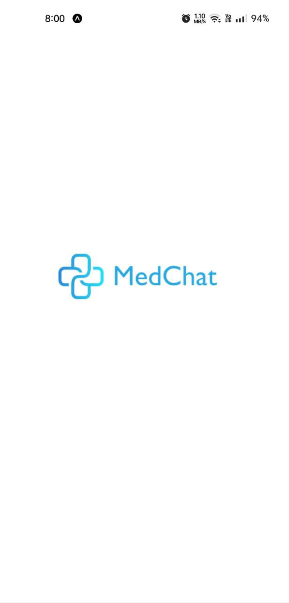
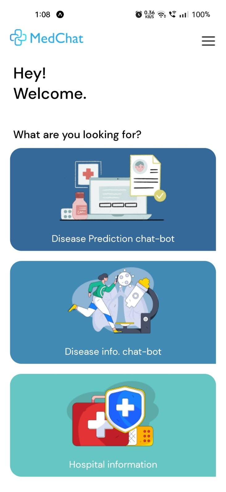
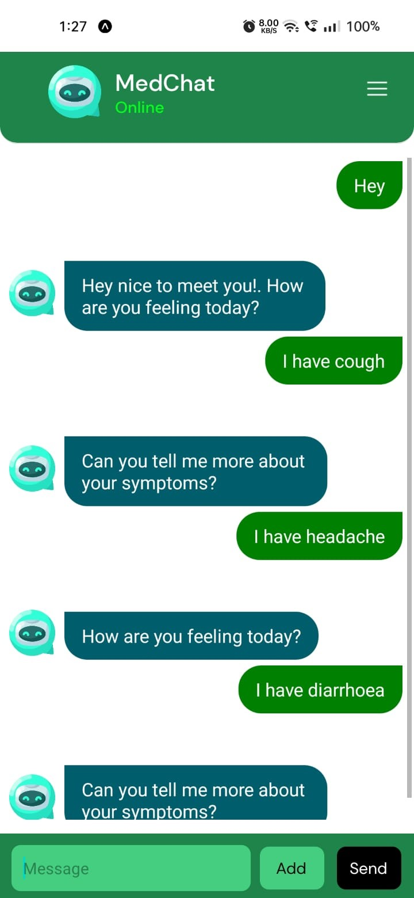
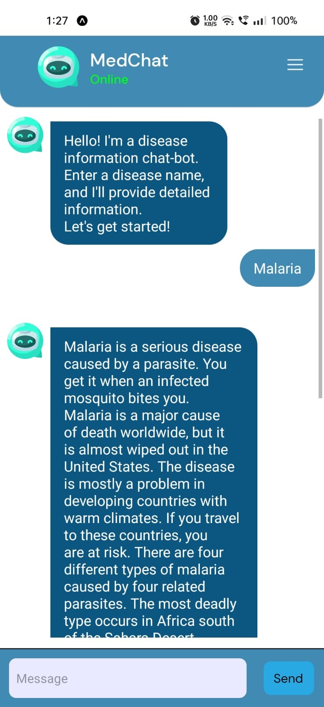
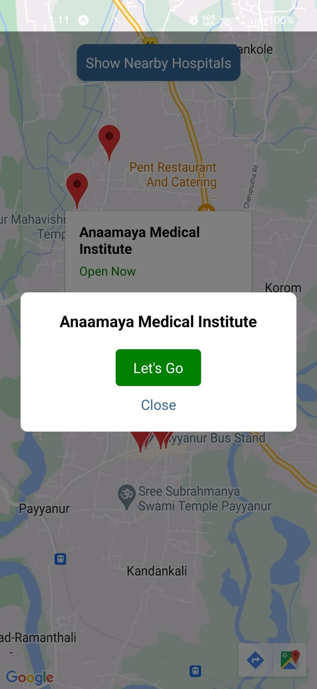
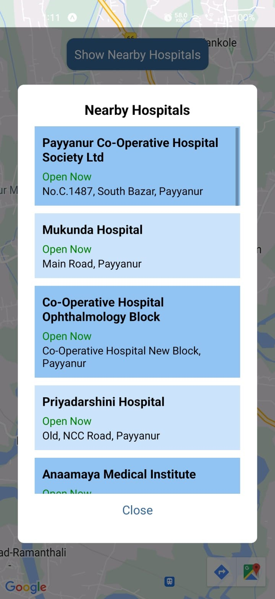

# MedChat

## Description
MedChat is a chatbot designed to provide medical assistance and information. It leverages machine learning techniques and natural language processing (NLP) algorithms to understand user queries, offer relevant responses, and provide guidance on various medical topics.

The chatbot utilizes a machine learning model trained on a  dataset of medical diseases and symptoms.

## Installation
1. Clone the repository.
2. Navigate to the project directory app-frontend and app-backend in two terminals.
3. Install the required dependencies.
4. Run the front-end on the ExpoGo app and the back-end simultaneously.
5. Success!

## Features
- **Disease Prediction**: The ML model will predict the disease based on the symptoms entered. We only provide a predictive diagnosis and always recommend the user to visit a doctor.
- **Medical Information**: Obtain detailed information about diseases, causes, and precautions. Data is fetched from NIH-NLM(National Institute of Health, National Library of Medicine) API.
- **Hospital Finder**: Find Nearby Hospitals using this option which is dedicated specially for nearby hospitals. Helpful during emergency situations.

## Screenshots

  &nbsp;&nbsp;&nbsp;
  &nbsp;&nbsp;&nbsp;
  &nbsp;&nbsp;&nbsp;
  &nbsp;&nbsp;&nbsp;
  &nbsp;&nbsp;&nbsp;
  &nbsp;&nbsp;&nbsp;

